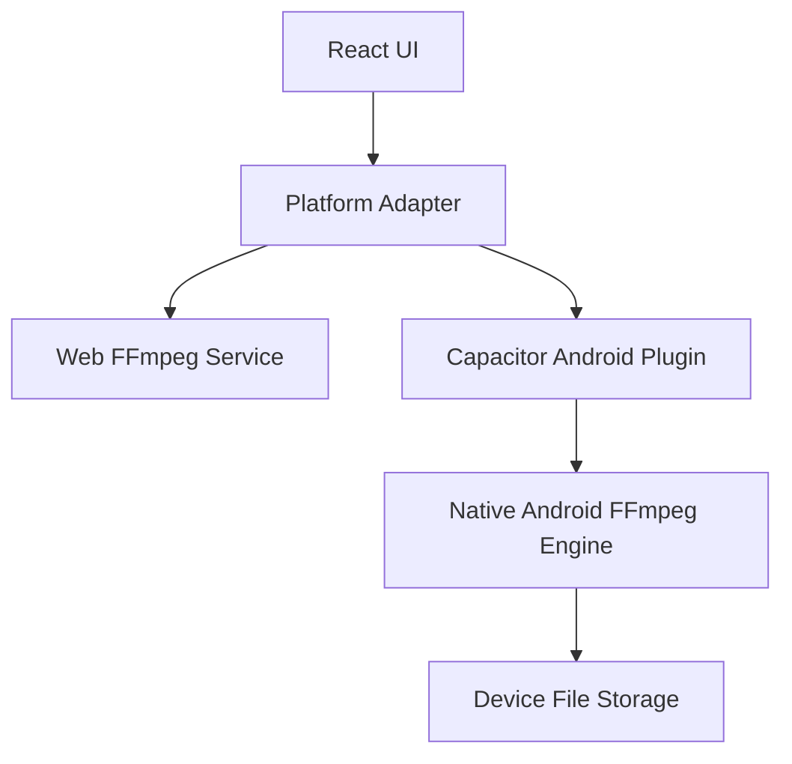

# Native Android FFmpeg Plugin Design

Feature Name: native-android-ffmpeg-plugin
Updated: 2026-05-05

## Description

当前 Android 方案依赖 `ffmpeg.wasm` 在 Capacitor WebView 中运行。该路径在 Android 端连续暴露出 `SharedArrayBuffer` 缺失、Worker 导入失败、`ffmpeg-core.js` 无法稳定加载等问题。为确保 Android 端的媒体转换能力稳定可用，本设计将 Android 的转换执行下沉到原生层，通过 Capacitor Plugin 暴露统一接口给前端。Windows 桌面版继续保留现有 Electron 方案，不与 Android 原生插件耦合。

## Architecture



架构说明：

- `React UI` 继续承载现有交互层，包括文件选择、输出格式、质量档位、进度和错误展示。
- `Platform Adapter` 负责根据平台选择执行路径：Windows/Electron 仍走前端方案，Android 走原生插件。
- `Capacitor Android Plugin` 负责桥接前端与原生层，暴露 `startTranscode`、`getJobStatus`、`cancelJob` 等接口。
- `Native Android FFmpeg Engine` 封装 FFmpeg 调用、参数拼装、任务状态、输出文件管理。

## Components and Interfaces

### 1. Frontend Platform Adapter

建议新增一个统一服务层，例如 `src/services/transcoder.ts`：

- `startTranscode(input, options)`
- `subscribeProgress(jobId, callback)`
- `readResult(jobId)`
- `cancel(jobId)`

该层内部按平台决定：

- Windows/Desktop: 调用现有 `ffmpeg.wasm`
- Android/Capacitor: 调用原生插件 API

### 2. Capacitor Android Plugin

建议插件接口：

- `startTranscode(options)`
  - 输入：`inputUri`, `outputFormat`, `quality`, `mediaType`
  - 输出：`jobId`
- `getJobStatus(jobId)`
  - 输出：`pending | running | completed | failed | cancelled`
- `getJobResult(jobId)`
  - 输出：`outputUri`, `size`, `mimeType`
- `cancelJob(jobId)`

### 3. Native Android FFmpeg Engine

原生引擎职责：

- 校验输入 URI 并复制到可读写工作目录
- 根据现有前端参数映射生成 FFmpeg 命令
- 执行原生 FFmpeg
- 记录日志、错误和输出文件元信息

## Data Models

```text
TranscodeRequest
- inputUri: string
- outputFormat: string
- quality: string
- mediaType: video | audio

TranscodeJob
- jobId: string
- status: pending | running | completed | failed | cancelled
- progress: number | null
- message: string
- outputUri: string | null
- error: string | null
```

## Correctness Properties

- Android 平台的转换执行不得依赖 `ffmpeg.wasm` 的 Worker 导入链路。
- Android 音频输出必须继续保留 `-vn` 逻辑，确保纯音频输出。
- 前端质量档位与 Android 原生命令映射必须与现有逻辑语义保持一致。
- Windows 打包工作流不得因 Android 原生插件引入而退化。

## Error Handling

- 输入文件不可访问：原生插件返回 `input_unavailable`
- 原生 FFmpeg 初始化失败：返回 `engine_init_failed`
- 转换命令执行失败：返回 `transcode_failed`
- 输出文件不存在：返回 `output_missing`
- 权限问题：返回 `storage_permission_denied`

前端应将上述错误转换为用户可理解摘要，并在错误详情中保留原始技术信息。

## Test Strategy

- 前端层：为平台适配器编写单元测试，验证 Android 与 Desktop 路径分流。
- Android 原生层：为命令参数映射、状态机和错误码映射编写测试。
- 集成层：至少验证以下场景：
  - 视频转 MP4
  - 视频转 M4A
  - 音频转 MP3
  - 大文件失败时的错误回传
  - 用户取消任务

## Migration Plan

1. 在新分支上保留现有 Capacitor 工程与 debug APK workflow。
2. 引入 Android 原生 FFmpeg 依赖与 Capacitor Plugin 骨架。
3. 抽离前端平台适配器，避免页面直接调用 `ffmpeg.wasm`。
4. 先在 Android 上接通最小转码链路，再扩充进度、取消、日志能力。
5. 最后回归验证 Windows 与 Android 两条链路。
